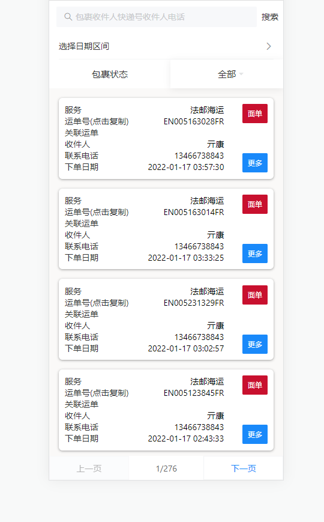
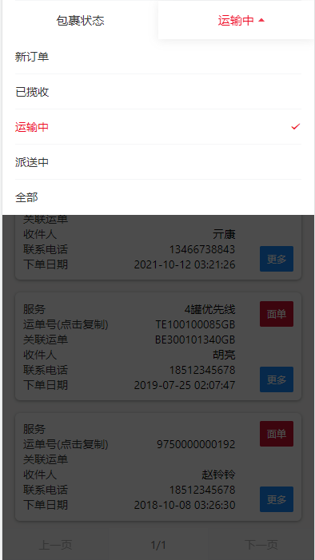

## React

> React技术测试

### Tasks

> 图一

> 图二

1. 能使用关键字进行搜索筛选。
2. 可通过下单日期的选择区间筛选出来对应的Item。
3. 列表有分页功能，如果能实现无限下拉加载更好。
4. 包裹状态可以使用DropdownMenu来进行筛选(如图二类似即可)。

### 基本要求如下

- 本地可运行

### 加分项

- 使用TypeScript
- 部署在合理空间/云平台上, 发布出来, 允许访问

### 提交

- 请 fork 仓库
- 追加包含你姓名的成果说明文件:
    + .md 格式
    + 各阶段用时
    + 本地开发部署说明
- 然后, 提交 PR
- 最后, 在对应面试群中, 给出PR链接